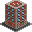

# reticulating-splines 

An isometric city building game.

## Description

This project is a simple isometric city builder inspired by games like SimCity 2000, built with Unity's 2D engine.

It will feature elements like RCI, resource management, economic simulation and more.